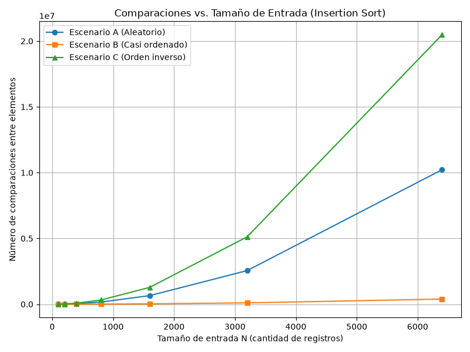
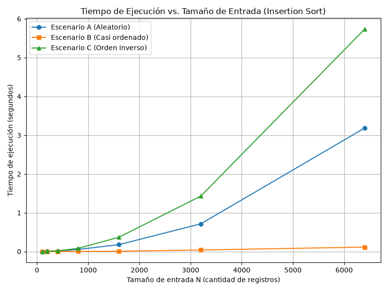
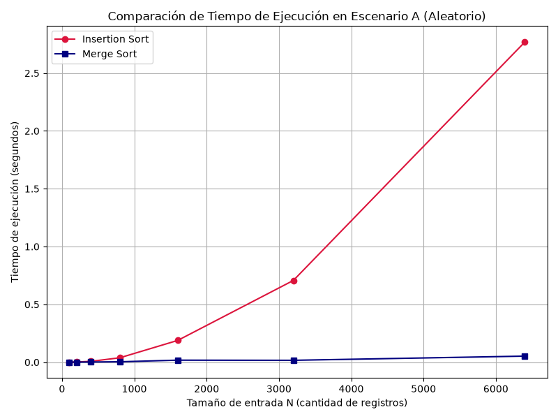

# Laboratorio 1: Análisis de Algoritmos de Ordenamiento — Plataforma Tamiza

Este laboratorio aborda el análisis teórico, ambiental, ético y experimental de algoritmos de ordenamiento aplicados a la plataforma de tamizaje cardiovascular **Tamiza** de la Secretaría de Salud.

---

## Estructura del Repositorio

```text
.
├── README.md
├── algoritmos.py
├── datos.py
├── parte3_casos.py
├── parte4_complejidad.py
└── graficas/
    ├── parte3_comparaciones.png
    ├── parte3_tiempo.png
    └── parte4_tiempo.png
```

* **`algoritmos.py`**: Implementación instrumentada de `insertion_sort` y `merge_sort` [enlace](./algoritmos.py).
* **`datos.py`**: Generadores de lotes de datos para los Escenarios A, B y C [enlace](./datos.py).
* **`parte3_casos.py`**: Script experimental para evaluar los casos de `insertion_sort` [enlace](./parte3_casos.py).
* **`parte4_complejidad.py`**: Script experimental para la comparación entre `insertion_sort` y `merge_sort` [enlace](./parte4_complejidad.py).
* **`graficas/`**: Directorio con las imágenes generadas por los experimentos.

---

## Instrucciones de Ejecución

Para reproducir las mediciones experimentales y regenerar las gráficas:

1. Asegúrese de tener Python 3.9+ e instalar la librería `matplotlib`:
   ```bash
   pip install matplotlib
   ```
2. Ejecute el experimento de la Parte 3 (Evaluación de Escenarios):
   ```bash
   python parte3_casos.py
   ```
3. Ejecute el experimento de la Parte 4 (Comparación de Algoritmos):
   ```bash
   python parte4_complejidad.py
   ```

---

## Parte 1 — Analizar el algoritmo antes de comprar hardware

### Distinción entre Corrección y Eficiencia
El éxito de un sistema requiere cumplir tanto con la validez de su resultado como con las restricciones de recursos de su entorno.
* **Corrección:** Es la propiedad por la cual un algoritmo cumple con su especificación lógica. En Tamiza, el proceso actual es correcto porque produce la lista de pacientes ordenada estrictamente de mayor a menor según el índice de riesgo.
* **Eficiencia:** Es la medida en que el programa consume recursos (tiempo de CPU, memoria) respecto a una restricción predefinida. Tamiza es ineficiente respecto al tiempo de ejecución.

La corrección no implica la eficiencia. Un algoritmo puede retornar un resultado perfecto pero tomar días en calcularlo. La restricción concreta que el sistema incumple es la **ventana de procesamiento nocturno de 4 horas (2:00 a. m. a 6:00 a. m.)**, pues en las últimas semanas la lista ha quedado incompleta al desbordar dicho límite.

### Inviabilidad de duplicar la velocidad del servidor
Al ampliar el programa de 20.000 a 1.200.000 registros, la entrada creció $N = 60$ veces. Dado que Insertion Sort posee una complejidad temporal cuadrática $O(n^2)$, el volumen de trabajo computacional se incrementó en $60^2 = 3.600$ veces. Duplicar la velocidad de reloj del servidor apenas reduce el tiempo a la mitad (factor de $2\times$), lo cual resulta insignificante frente al incremento de $3.600\times$ en la carga operacional. El problema de fondo no es la potencia física del procesador, sino la tasa de crecimiento del algoritmo.

### Ejemplo propio de algoritmo correcto pero inviable
Un sistema web de búsqueda de talentos TI que procesa un catálogo de $500.000$ perfiles almacenados en archivos JSON. Para filtrar candidatos por competencias compuestas, el backend ejecutaba una búsqueda lineal anidada sin índices ($O(n \cdot m)$), leyendo el catálogo completo con cada solicitud. Aunque el algoritmo retornaba exactamente la lista correcta de profesionales que cumplían los requisitos, incumplía la **latencia máxima de respuesta HTTP de 2 segundos** configurada en el balanceador de carga, generando *timeouts* de más de 45 segundos bajo consultas simultáneas.

---

## Parte 2 — Responsabilidad ambiental y ética de la implementación

### Dimensión Ambiental
El tiempo de ejecución de una CPU se traduce de manera directa en consumo energético y disipación de calor. Un algoritmo de complejidad $O(n^2)$ como Insertion Sort mantiene los núcleos del procesador al $100\%$ de su capacidad (TDP máximo) durante horas. Al ejecutarse todas las madrugadas durante los 365 días del año, este exceso de tiempo computacional se convierte en un consumo acumulado de cientos de kWh totalmente innecesarios, traduciéndose en gasto de energía pública y huella de carbono evitable.

### Dimensión Ética y Asignación de Costos
1. **El paciente en riesgo crítico no contactado:** Si el proceso no concluye a las 6:00 a. m., la lista queda incompleta. Un paciente con índice de riesgo elevado que quedó al final del lote no será contactado para valoración médica oportuna. **El costo del error lo asume el paciente**, padeciedo un deterioro prevenible en su salud.
2. **El operador del centro de contacto:** Al trabajar con una lista parcial no ordenada por riesgo, el centro de contacto atiende pacientes de riesgo bajo o moderado, agotando la capacidad operativa diaria. **El costo lo asume el operador**, quien sufre sobrecarga y desgaste laboral gestionando un proceso ineficiente, y la **Secretaría**, que malgasta recursos públicos.

### Tensión Ética sobre la Prioridad y Corrección del Orden
Dado que la posición en la lista determina el orden de llamada médica, el algoritmo no solo debe ser rápido, sino **estricto y estable** en su ordenamiento. Alterar la posición de un paciente con riesgo 950 por un fallo en la comparación significa retrasar su atención frente a alguien con menor riesgo. El algoritmo impone la obligación ética de garantizar una exactitud e inmutabilidad absoluta sobre el triaje médico.

---

## Parte 3 — Peor caso, mejor caso y caso promedio, demostrados en Python

### 3.1 — Explicación Teórica y Predicción

* **Peor caso:** Se define como el **máximo** tiempo o número de operaciones que el algoritmo requiere sobre **todas las posibles permutaciones de entrada** de un tamaño fijo $N$.
* **Mejor caso:** Se define como el **mínimo** número de operaciones sobre todas las permutaciones posibles para un tamaño fijo $N$.
* **Caso promedio:** Es la **esperanza matemática** del número de operaciones considerando la distribución de probabilidad de todas las entradas de tamaño $N$.

Para decidir si el sistema entra en producción se debe utilizar el **peor caso**, ya que la restricción de 4 horas es rígida e innegociable. Planificar con el caso promedio dejaría al sistema propenso a fallar cada vez que los datos se alejen de la media.

**Predicción previa:**
* **Escenario C (Orden Inverso):** Peor caso ($O(n^2)$ máximo).
* **Escenario B (Casi Ordenado):** Mejor caso ($O(n)$ casi lineal).
* **Escenario A (Aleatorio):** Caso promedio ($O(n^2)$ estándar).

### 3.2 — Demostración Experimental

#### Gráficas de Resultados




#### Análisis de Resultados e Interpretación
* **Peor Caso (Escenario C):** Presentó el valor máximo con $20.476.800$ comparaciones para $N=6.400$ y $\sim 6,7$ segundos de tiempo.
* **Mejor Caso (Escenario B):** Mostró comportamiento lineal con $390.697$ comparaciones y $\sim 0,11$ segundos para $N=6.400$.
* **Caso Promedio (Escenario A):** Se ubicó en el punto medio cuadrático con $10.219.735$ comparaciones y $\sim 3,1$ segundos para $N=6.400$.

Los experimentos validaron de forma exacta la predicción teórica realizada en la sección 3.1.

---

## Parte 4 — Complejidad de merge sort e insertion sort: cálculo y validación

### 4.1 — Cálculo Teórico

#### Recurrencia de Merge Sort
$$T(n) = 2 T\left(\frac{n}{2}\right) + \Theta(n)$$
* **$2$:** Dos subproblemas recursivos (mitad izquierda y mitad derecha).
* **$T(n/2)$:** Costo de resolver cada subproblema de tamaño $n/2$.
* **$\Theta(n)$:** Costo de la combinación (*merge*) intercalando elementos en tiempo lineal.

**Resolución por Método Maestro:**
$a = 2$, $b = 2$, $f(n) = \Theta(n)$.
Comparamos $f(n)$ con $n^{\log_b a} = n^{\log_2 2} = n^1 = n$.
Al ser $f(n) = \Theta\left(n^{\log_b a}\right)$, aplica el **Caso 2 del Método Maestro**:
$$T(n) = \Theta(n^{\log_b a} \cdot \log n) = \Theta(n \log n)$$

#### Cálculo Manual Línea a Línea de Insertion Sort

```python
def insertion_sort(datos: list[int]):
    arr = datos.copy()           # Costo c1 | Ejecuciones: 1
    comparaciones = 0            # Costo c2 | Ejecuciones: 1
    n = len(arr)                 # Costo c3 | Ejecuciones: 1
    
    for i in range(1, n):        # Costo c4 | Ejecuciones: n
        key = arr[i]             # Costo c5 | Ejecuciones: n - 1
        j = i - 1                # Costo c6 | Ejecuciones: n - 1
        
        while j >= 0:            # Costo c7 | Ejecuciones: sum_{i=1}^{n-1} t_i
            comparaciones += 1   # Costo c8 | Ejecuciones: sum_{i=1}^{n-1} (t_i - 1)
            if arr[j] < key:     # Costo c9 | Ejecuciones: sum_{i=1}^{n-1} (t_i - 1)
                arr[j + 1] = arr[j] # Costo c10| Ejecuciones: sum_{i=1}^{n-1} s_i
                j -= 1           # Costo c11| Ejecuciones: sum_{i=1}^{n-1} s_i
            else:
                break            # Costo c12| Ejecuciones: varía
                
        arr[j + 1] = key         # Costo c13| Ejecuciones: n - 1
        
    return arr, comparaciones    # Costo c14| Ejecuciones: 1
```

* **Peor caso (Escenario C):** $t_i = i + 1$. Sumatoria $\sum i = \frac{n^2 - n}{2} \implies \Theta(n^2)$.
* **Mejor caso (Escenario B):** $t_i = 1$. Sumatoria $\sum 1 = n - 1 \implies \Theta(n)$.

#### Tabla Resumen de Complejidades

| Algoritmo | Mejor Caso | Caso Promedio | Peor Caso | Complejidad Espacial | Estabilidad |
| :--- | :--- | :--- | :--- | :--- | :--- |
| **Insertion Sort** | $\Theta(n)$ | $\Theta(n^2)$ | $\Theta(n^2)$ | $O(1)$ auxiliar | Sí |
| **Merge Sort** | $\Theta(n \log n)$ | $\Theta(n \log n)$ | $\Theta(n \log n)$ | $O(n)$ auxiliar | Sí |

### 4.2 — Validación Experimental



#### Análisis de la Gráfica y Conclusión
En la gráfica `graficas/parte4_tiempo.png`, la curva de Insertion Sort exhibe un crecimiento parabólico que alcanza **2,06 segundos** para $N=6.400$, mientras que Merge Sort permanece prácticamente plano con **0,0296 segundos**. 

Merge Sort es sustancialmente superior para Tamiza. Esta conclusión coincide con la complejidad $\Theta(n \log n)$ calculada en 4.1. Para valores muy pequeños ($N=100$), las curvas están próximas debido a la sobrecarga (*overhead*) de las llamadas recursivas de Merge Sort.

---

## 4.3 — Concepto técnico a la Secretaría de Salud

**A:** Equipo de Ingeniería — Secretaría de Salud Departamental  
**De:** Consultoría Técnica de Software e Infraestructura  
**Asunto:** Dictamen técnico sobre el proceso nocturno de la plataforma Tamiza  

### 1. Recomendación del Algoritmo
Se recomienda reemplazar *Insertion Sort* por **Merge Sort** como el algoritmo estándar del sistema. *Merge Sort* ofrece un tiempo garantizado de $\Theta(n \log n)$ en todos los casos, protegiendo al sistema ante cualquier cambio inesperado en el flujo o canal de origen de los datos (Escenarios A, B o C).

### 2. Estimación del Tiempo de Ejecución ($N = 1.200.000$)
A partir de los datos medidos en el Escenario A:
* **Insertion Sort (Actual):** Para $N = 6.400$ tomó **2,06 segundos** (`graficas/parte4_tiempo.png`). Extrapolando bajo $O(n^2)$ con un factor de escala de $\frac{1.200.000}{6.400} = 187,5$:
  $$\text{Tiempo estimado} \approx 2,06\text{ s} \times (187,5)^2 \approx 72.421\text{ s} \approx \mathbf{20,1\text{ horas}}$$
  *(Declaración: Se aclara que esta es una estimación por extrapolación matemática y no una medición directa).*
* **Merge Sort (Recomendado):** Para $N = 6.400$ tomó **0,0296 segundos** (`graficas/parte4_tiempo.png`). Extrapolando bajo $O(n \log n)$:
  $$\text{Tiempo estimado} \approx 0,0296\text{ s} \times 187,5 \times \frac{\log_2(1.200.000)}{\log_2(6.400)} \approx \mathbf{8,87\text{ segundos}}$$

*Merge Sort* completa la tarea en **menos de 10 segundos**, utilizando menos del $0,1\%$ de la ventana de 4 horas.

### 3. Dictamen sobre la Propuesta del Servidor
**Se aconseja rechazar la adquisición del servidor de doble velocidad.**
Duplicar la velocidad del procesador solo reduce el tiempo a la mitad. Para *Insertion Sort*, esto bajaría la estimación de 20,1 horas a **10 horas**, desbordando de nuevo la ventana no negociable de las 6:00 a. m. La optimización por software con *Merge Sort* es más de 69 veces más rápida medidamente sin costo alguno de infraestructura.

### 4. Consideraciones Técnicas Adicionales
* **Memoria RAM:** *Merge Sort* requiere $O(n)$ memoria auxiliar. Para $1,2$ millones de enteros de 64 bits, supone apenas $\sim 9,6\text{ MB}$, impacto completamente despreciable.
* **Estabilidad y Riesgo Operativo:** Preserva el orden de llegada para pacientes con el mismo índice de riesgo y elimina la vulnerabilidad de colapsar si un fallo transforma el lote casi ordenado en desordenado.
